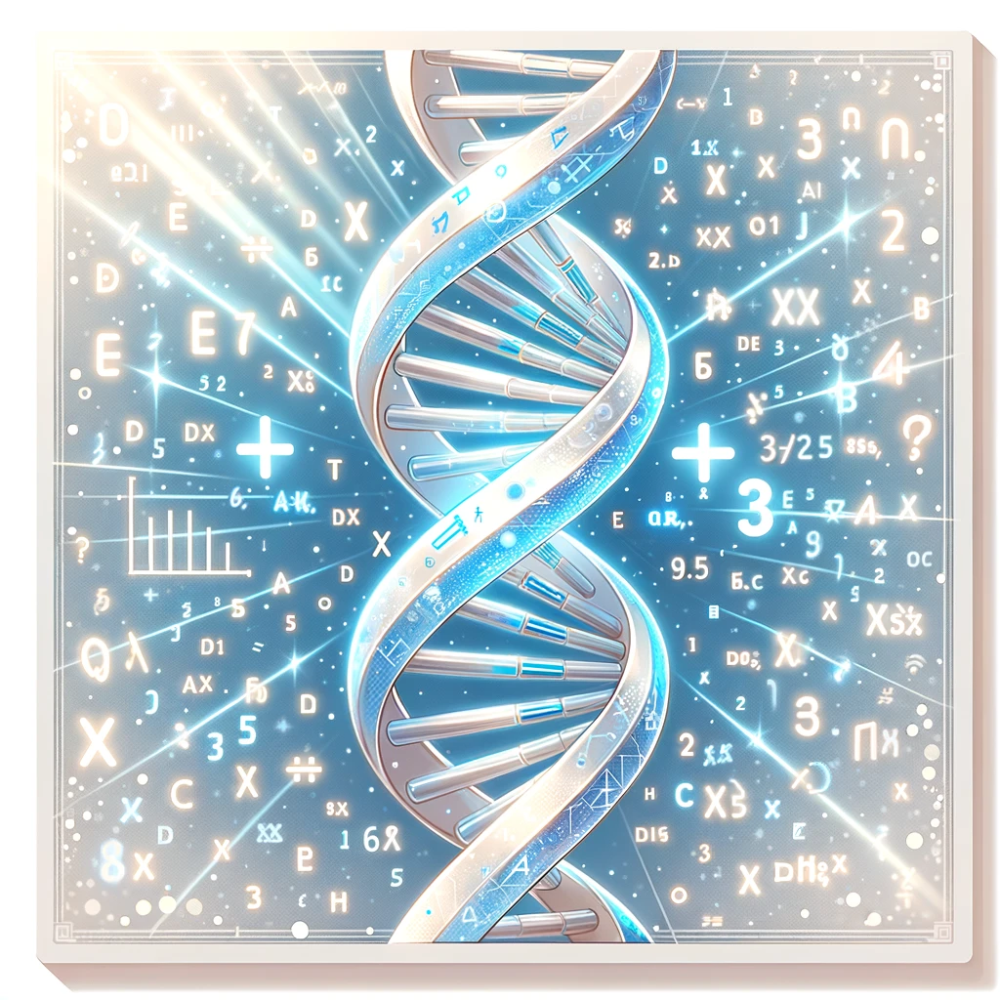

# Data Science for Medicine and Biology

### Thanks for your interest in this course

It is with a great pleasure that we release this course to the biomedical community. Whether you are a medical doctor, nurse, molecular biologist or ecology student, you will certainly benefit from the knowledge you will find here.

Data Science and Machine Learning became a fundamental part of life sciences. The ability to analyze your own data means freedom - not to mention the opportunities that will come your way when you demonstrate that you can transform data into knowledge.

Here, you will find all the source code and datasets for the course.

The organization of the material is:

> - **/datasets** - contains the datasets to reproduce everything you saw in the lessons and to create the figures.
> - **/Python** - contains the Python code for the first module.
> - **/Statistics** - the code for all statistical analyses.
> - **/Machine_Learning** - all material to train, evaluate and test classifiers (and other algorithms).
> - **/Colab_Notebooks** - ready to download and use Colab Notebooks for all lessons.

And THANKS for everyone who joined our community. You are NOT alone in this challenge.

> - **Youtube:** https://www.youtube.com/@NezuLifeSciences-English
> - **Facebook:** https://www.facebook.com/profile.php?id=61553356708703
> - **Twitter/X:** https://twitter.com/NezuLifeEnglish
> - **Linkedin:** https://www.linkedin.com/groups/14353421/
> - **Discord:** https://discord.gg/SU2sEsV3

Made with ❤️  by Tiago Lopes, PhD - the founder of Nezu Life Sciences.

If you find any issues with the code, please contact us: president@nezulife.com.

On the behalf of the Nezu Life Sciences community, we appreciate your interest in the Data Science for Medicine and Biology course.
